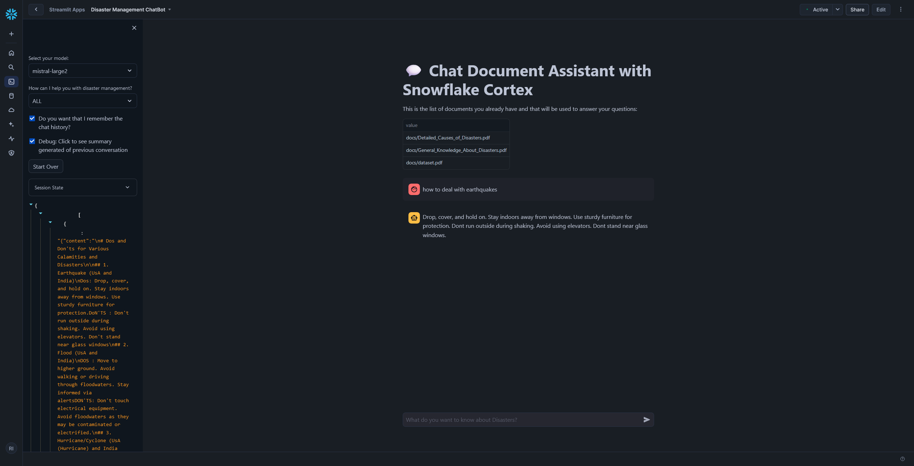
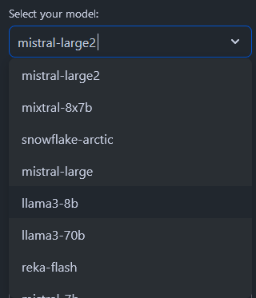
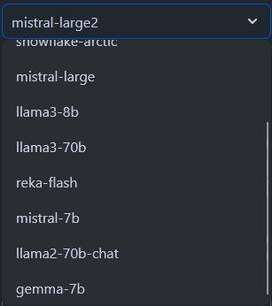

# RAG 'n' ROLL Hackathon: Amp up Search with Snowflake & Mistral

Welcome to the repository for my Retrieval Augmented Generation (RAG) application, developed as part of the **RAG 'n' ROLL Hackathon**. This project leverages cutting-edge AI technologies to revolutionize information retrieval and generation.

## Application Overview

This Retrieval Augmented Generation (RAG) application combines the following technologies:

- **Cortex Search**: Efficient and scalable document retrieval system.
- **Mistral LLM (mistral-large2)**: Advanced language model hosted on Snowflake Cortex for generating precise and contextually relevant responses.
- **Streamlit Community Cloud**: Intuitive front-end for a seamless user experience.

### Screenshots

### Live Demo

You can access the live application here:
[Streamlit Link (Limited Time)](https://app.snowflake.com/azchupb/xcb37342/#/streamlit-apps/CC_QUICKSTART_CORTEX_SEARCH_DOCS.DATA.C7UG1Y2VVL77DOQT?ref=snowsight_shared)

## Features

- **Advanced Information Retrieval**: Uses Snowflake Cortex Search to retrieve the most relevant documents for a given query.
- **Contextual Response Generation**: Leverages Mistral LLM to generate accurate, context-aware answers.
- **Interactive Front-End**: Built using Streamlit for an engaging and user-friendly interface.

## How It Works

1. **User Query**: Users input their queries via the Streamlit interface.
2. **Document Retrieval**: Cortex Search retrieves relevant chunks of documents stored in Snowflake.
3. **Response Generation**: The Mistral LLM generates a response using the retrieved context.

## Results and Learnings

- **Relevance Score**: Improved by optimizing the document retrieval threshold.
- **Groundedness**: Ensured responses are grounded in the provided context.
- **Efficiency**: Reduced response latency through Snowflake query optimizations.

## Resources

- [Snowflake Cortex Documentation](https://quickstarts.snowflake.com/)
- [TruLens Documentation](https://trulens.org/)
- [Streamlit Documentation](https://docs.streamlit.io/)
